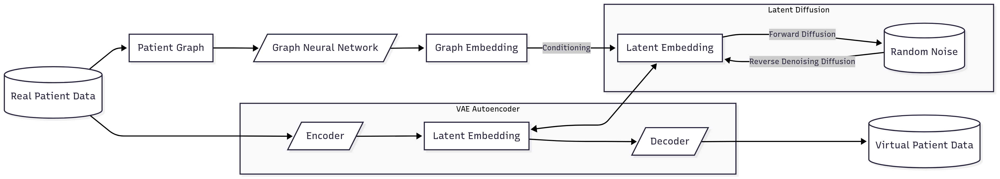

# TabGraphSyn: Tabular Data Generation with Graph Neural Networks and Latent Diffusion Models

This repository contains the code for single table synthetic data generation using graph embeddings as conditioning information.

This project presents a novel method for synthetic tabular data generation that uses a graph representation of data records within a single table. We combine the expressive power of graph neural networks and generative capabilities of latent diffusion models to achieve high-quality synthetic data generation.

<p align="center">
  
</p>

## Installation
Create environment and install requirements
```bash
conda create -n tabgraphsyn python=3.10
conda activate tabgraphsyn
pip install -r requirements.txt
```

### Preprocess data
```bash
python src/scripts/preprocess_data.py --dataset-name DATASET_NAME
```

### Single Table Generation with Graph Embeddings

This project supports single table generation using graph embeddings as conditions. This approach allows you to leverage the graph structure between data records to condition the generation of high-quality synthetic data.

#### Training a model for single table generation:
```bash
python src/scripts/single_table_gen.py --dataset-name DATASET_NAME --target-table TABLE_NAME --train
```

#### Sampling from the trained model:
```bash
python src/scripts/single_table_gen.py --dataset-name DATASET_NAME --target-table TABLE_NAME --sample --num-samples 1000
```

The generated data will be saved in `data/synthetic/DATASET_NAME/SingleTable/single_table/TABLE_NAME.csv`.

#### Additional options:
- `--factor-missing`: Factor missing values (recommended)
- `--positional-enc`: Use positional encoding
- `--retrain-vae`: Retrain the VAE
- `--model-type`: Choose between "mlp" or "unet" for the diffusion model
- `--normalization`: Choose the normalization type ("quantile", "standard", or "cdf")
- `--seed`: Set random seed for reproducibility
- `--epochs-vae`, `--epochs-diff`, `--epochs-gnn`: Configure training epochs
- `--gnn-hidden`: Configure GNN hidden dimensions
- `--denoising-steps`: Set number of denoising steps for sampling

### Running Complete Pipeline

For a complete end-to-end pipeline, you can use:

#### Main Pipeline (Graph-Conditioned Generation):
```bash
python src/scripts/run_pipeline.py --dataset-name DATASET_NAME --target-table TABLE_NAME
```

#### Baseline Pipeline (Unconditional Generation):
```bash
python src/scripts/run_baseline_pipeline.py --dataset-name DATASET_NAME --table-name TABLE_NAME
```

### Supported Datasets

The system has been tested with the following datasets:
- AIDS
- TCGA
- WBCD

## Architecture

The system consists of three main components:

1. **VAE (Variational Autoencoder)**: Encodes tabular data into latent representations
2. **GNN (Graph Neural Network)**: Learns graph embeddings from the data structure
3. **Diffusion Model**: Generates new data conditioned on graph embeddings

## File Structure

- `src/tabgraphsyn/` - Main package containing the core algorithms
- `src/scripts/` - Training and sampling scripts
- `src/data/` - Data processing utilities
- `data/` - Dataset storage (original, processed, synthetic)
- `src/ckpt/` - Model checkpoints

## Example Usage

For the WBCD dataset:

1. **Preprocess the data:**
   ```bash
   python src/scripts/preprocess_data.py --dataset-name WBCD
   ```

2. **Train the model:**
   ```bash
   python src/scripts/single_table_gen.py --dataset-name WBCD --target-table WBCD --train --factor-missing --positional-enc
   ```

3. **Generate synthetic data:**
   ```bash
   python src/scripts/single_table_gen.py --dataset-name WBCD --target-table WBCD --sample --factor-missing --positional-enc --num-samples 1000
   ```

## Key Features

- **Graph-Conditioned Generation**: Uses k-nearest neighbor graphs to capture data structure
- **Missing Value Handling**: Supports factoring of missing values during training
- **Flexible Architecture**: Supports both MLP and U-Net based diffusion models
- **Positional Encoding**: Optional positional encoding for enhanced graph representation
- **Multiple Normalization Options**: Supports quantile, standard, and CDF normalization

## Django Web Interface

The repository now ships with a lightweight Django site that wraps a simplified tabular synthetic data pipeline.

### Quick start
1. Create and activate a Python 3.10+ virtual environment.
2. Install the minimal web dependencies with `pip install -r requirements-web.txt`.
3. Apply migrations with `python manage.py migrate` (uses the default SQLite database).
4. Launch the development server via `python manage.py runserver`.
5. Open http://127.0.0.1:8000/ to upload a CSV, generate synthetic rows, and download the results.

The web UI stores generated CSVs under `media/generated/` and keeps a preview available on the result page. Each run also records metadata (input filename, seed, row counts) to make follow-up reviews easier.
### MongoDB-backed authentication
The Django UI now requires signing in before any uploads or synthetic runs are launched. Credentials live in MongoDB so they can be managed alongside the rest of your infrastructure.

1. Ensure MongoDB is running locally (the defaults assume `mongodb://localhost:27017`).
2. (Optional) Override the connection via environment variables: 
   - `TABGRAPHSYN_MONGO_URI` (connection string)
   - `TABGRAPHSYN_MONGO_DB` (database, defaults to `tabgraphsyn`)
   - `TABGRAPHSYN_MONGO_USERS_COLLECTION` (collection, defaults to `users`)
3. Provision or update a user document via the helper command:
   ```bash
   python manage.py create_mongo_user admin changeme --email admin@example.com --full-name "Workspace Admin"
   ```
   Passwords are hashed with Django's password hasher before being stored.
4. Start the dev server and browse to `http://127.0.0.1:8000/auth/login/` to sign in. The header now shows the active user and exposes a **Sign out** button that submits a POST request to `/auth/logout/`.
5. Prefer a UI-driven flow? Open `/auth/register/` to create a username/password pair directly in MongoDB.

All REST endpoints return `401` JSON responses when the session is not authenticated, while traditional pages redirect back to the login form with the original path captured in a `next` parameter.

### Run history portal
Every successful pipeline execution now writes its metadata to MongoDB (collection defaults to `tabgraphsyn.runs`). This mirrors the JSON file we already store in `media/generated/` but makes it trivial to query or audit centrally.

- Configure the target collection via `TABGRAPHSYN_MONGO_RUNS_COLLECTION` if you do not want to use `runs`.
- Browse https://127.0.0.1:8000/history/ after signing in to see your most recent runs, including dataset/table, source, row counts, and quick links back to the detailed result page.
- Each document records the owner info, timestamps, evaluation payload, and filesystem pointers, so you can also explore it with `mongosh` or Compass.

### Production deployment and security
- Set `DEBUG=False`, `SECRET_KEY`, and a production `ALLOWED_HOSTS` list.
- Enable authentication and per-user isolation with `WORKSPACE_AUTH_REQUIRED=True` and `WORKSPACE_ENFORCE_OWNER=True`.
- When deploying behind a proxy/load balancer (AWS ALB/ELB, Nginx), set `USE_PROXY_HEADERS=True` and terminate TLS at the edge.
- CSP is enabled by default when `DEBUG=False`. If you add new CDN assets, update the CSP lists in `tabgraphsyn_site/settings.py`.
- Run with Gunicorn (see `Dockerfile`) and serve static/media via Nginx or your cloud provider. Persist the `media/` directory.

### Concurrency and GPU sizing guidance
- The web UI is lightweight, but the training pipeline is heavy and currently runs inside the web process. For production, keep `PIPELINE_MAX_CONCURRENT=1` to protect GPU memory.
- For higher concurrency, split the pipeline into a worker service (Celery/Redis or a job queue) and keep the web tier CPU-only.
- GPU sizing is workload-dependent. Typical single-table jobs (tens of thousands of rows, tens of columns) run comfortably on a 16GB GPU. Larger datasets or larger diffusion settings can require 24-40GB.
- CPU-only runs are possible but usually 5-20x slower; reserve GPU for training and sampling for acceptable turnaround.

## 🚀 Deployment to Production

### Deploy with GPU Support

This project includes complete deployment configuration for GPU-enabled hosting platforms like RunPod, Vast.ai, Lambda Labs, and cloud providers.

#### Quick Start (15 minutes)
For a rapid deployment guide, see [deploy/QUICK-START.md](deploy/QUICK-START.md)

**Quick steps:**
1. Get a GPU instance on RunPod or Vast.ai (~$0.20-0.40/hour)
2. Clone repository and configure environment
3. Run `docker compose up -d`
4. Access your site at `http://YOUR_IP`

#### Comprehensive Deployment Guide
For detailed instructions including domain setup, SSL configuration, and cost optimization, see [DEPLOYMENT.md](DEPLOYMENT.md)

**Covers:**
- Platform selection (RunPod, Vast.ai, cloud providers)
- GPU instance setup and configuration
- Domain registration and DNS configuration
- SSL/HTTPS setup with Let's Encrypt or Cloudflare
- Production security checklist
- Monitoring and backups
- Cost optimization strategies (~$10-20/month)

#### Deployment Files
- [Dockerfile](Dockerfile) - GPU-enabled container with CUDA support
- [docker-compose.yml](docker-compose.yml) - Complete stack (Django + MongoDB + Nginx)
- [deploy/nginx.conf](deploy/nginx.conf) - Production nginx configuration
- [deploy/supervisord.conf](deploy/supervisord.conf) - Process management
- [.env.production.example](.env.production.example) - Production environment template

### Cost-Effective Deployment Strategies

**Option 1: All-in-One GPU Instance**
- Single server runs web app + model training
- RunPod/Vast.ai GPU instance: ~$0.20-0.40/hour
- Stop when not in use to save costs
- Best for: Development and small-scale production

**Option 2: Hybrid Deployment** (Most cost-effective)
- Web app: Free tier (Render, Railway) or cheap VPS ($5/month)
- GPU: On-demand only when training models
- MongoDB: Free tier (Atlas) or included with web hosting
- Best for: Production with occasional training
- **Cost: ~$10-20/month**

**Option 3: Enterprise Cloud**
- Auto-scaling on AWS, GCP, or Azure
- Managed services for database, storage, monitoring
- Best for: High-traffic production deployments
- Cost: Varies based on usage

### Domain Setup

Get your site online with a custom domain:
1. **Purchase domain** (~$10/year): Namecheap, Cloudflare, Porkbun
2. **Configure DNS**: Point A record to your server IP
3. **Enable SSL**: Use Cloudflare (free) or Let's Encrypt
4. **Update settings**: Set `ALLOWED_HOSTS` and `CSRF_TRUSTED_ORIGINS` in `.env`

See [DEPLOYMENT.md](DEPLOYMENT.md) for step-by-step instructions.

